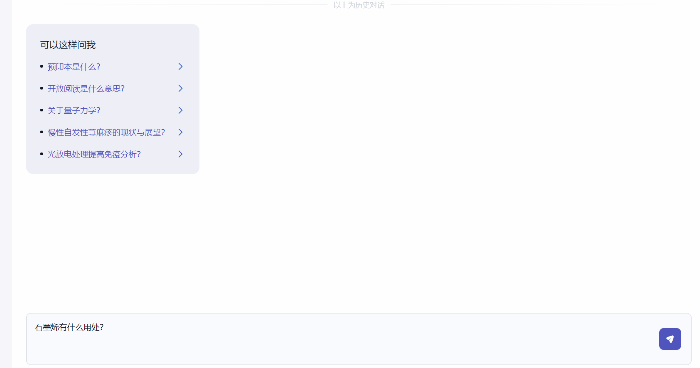
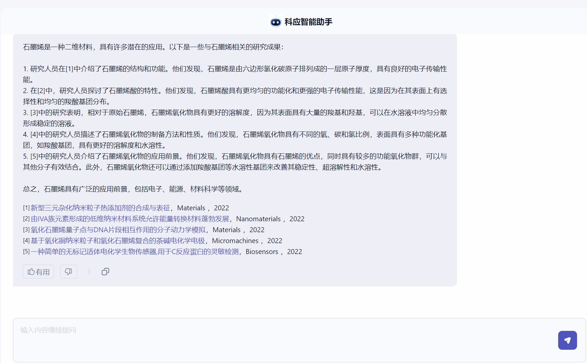
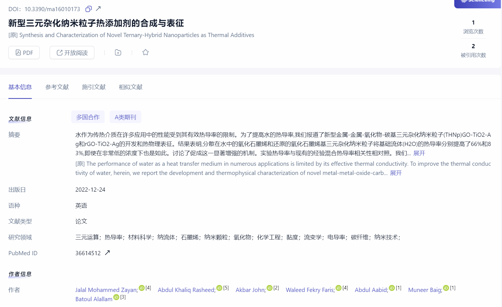

一、背景说明：         

       1.1. 本项目为外文文献检索相关demo, 由chatgpt根据几亿外文文献，每一段生成若干英文问题答案对。
             然后问题和答案对翻译成中文，组成中文问题答案   
       1.2. 对中文问题和英文问题，生成768维向量，插入ES8索引中，其中向量字段类型为："dense_vector“，
             向量相似度算法为:consine, 应用层使用向量做KNN语义检索。   
       1.3. 用户输入问题后，会即时生成问题向量，在ES8中检索语义相似问题，用中文问话就搜索中文问题，用英文问话就搜索英文问题。   
       1.4. 匹配语义最相似5个问题，查出对应答案，组成问题/答案提示，将用户问的问题本身及找到的问题答案对，发给Llama2大模型，
            由大模型综合这些来自于真实外文文献的问题答案对，生成综合答案，返回给用户，作为基于文献内容的答案。   
       1.5. 这样用户会节省阅读外文文献的时间，跨过语言障碍快速了解文献内容。   
	
二、运行环境：      
  python3.7, java 1.8及以上
  
三、数据说明：      
  3.1. src/datasets目录：     
  
       1. question_en:英文问题      
       2.answer_en:英文答案      
       3. question_cn:英文问题翻译过来的中文问题      
       4.answer_cn:翻译过来的中文答案      
       5.question_en_vector:英文问题和向量       
       4.question_cn_vector:中文问题的向量      
       5.article_doi：文献doi            
       
   上述数据是实际项目几百万问答对中，抽取10000条做demo. 每行一条记录。

  3.2. scripts\python 下文件说明：
  
    3.2.1 batch-sentence-transformers_multilingual768.py      
             批量将英文问题和中文问题生成向量，输入文件为：question_en/cn, 输出向量文件：question_en/cn_vector用法：
	     python batch-sentence-transformers_multilingual768.py "question_en" "question_en_vector"
             python batch-sentence-transformers_multilingual768.py "question_cn" "question_cn_vector"
   
    3.2.2 indexer_elastic_multilingual768_faq.py
             将上述数据文件、生成的英文和中文向量，插入ES8 索引中，用法：
             python indexer_elastic_multilingual768_faq.py article_doi question_en answer_en question_en_vector question_cn answer_cn question_cn_vector
   
    3.2.3 single-sentence-transformers_multilingual768.py
             用户问话后，使用此脚本即时生成向量，此脚本需要作为常驻内存Api服务，供应用层调用，输入为用户问话，返回为该问话的向量。用法：
             python3.7 -m uvicorn single-sentence-transformers_multilingual768:app --reload --host 0.0.0.0 --port 8002 --reload
   
    3.2.3 gradio_web_server_api.py
             根据用户问话的向量从ES8检索(Knn检索,consine相似度），检索出文献问题向量最相似（语义相似）的5条，
	     组成prompt,把用户问题和prompt提供给Llama2大模型，生成答案，由于大模型是以单个字的推理形式生成答案，以流式返回客户端，客户端显示为一个字一个字的反馈答案更新。
             此脚本需要作为常驻内存Api服务，供应用层调用，输入为用户问题和参考答案组成的Prompt，返回具体答案的流式推理（一个字一个字的更新），
	     让大模型根据文献中查询出来的参考答案回答用户问题。相当于帮助用户理解文献，解决实际问题。
             uvicorn  gradio_web_server_api:app --reload --host 0.0.0.0 --port 8007 --timeout-keep-alive 120
   
  3.3. scripts\java 下文件说明： 
  
    3.3.1. AIKNNSearchController.java AIKNNSearchService.java
          spring boot 的MVC架构中的controller层，调用service层方法，首先接受前端传过来的用户问题，然后调用single-sentence-transformers_multilingual768.py里面的api接口，
	  即时生成向量，再调用service中ES方法，进行Knn语义向量检索，取出若干语义最相似问题答案对，连同用户从终端界面问的问题，组成prompt作为基于专业文献内容的参考答案，预备给大模型。
 
    3.3.2. StreamingPythonController.java
           上述步骤生成的prompt，通过该controller中的逻辑，调用大模型接口(gradio_web_server_api.py),这是Llama2大模型api接口，只有python版本，
	   大模型根据prompt回答最终的用户问题。返回是单个字的连续推理，流式返回到前端，在用户界面上显示为类似chatgpt的逐字显示的形式。
           prompt问题模板可以有不同形式，可以严格禁止大模型越过prompt中的参考答案，回答政治敏感问题。也可适度允许大模型结合对prompt内容理解和模型原生的训练语料一同给出一个范围更大的答案。
 
    3.3.3.  index.html及js中的文件
           为用户终端页面的demo，稍加改造，即可用于用户输入问题，调用1中的接口，获取参考答案，组成prompt，再调用StreamingPythonController.java中的接口，
	   用SSE的长连接形式，向大模型发问，大模型流式返答案，由SSE接收，逐字分批显示给用户推理后的答案
 

 
四、完整ES8 demo索引mapping为：      

    renda_dense_index768
        {
	 "mappings": {
	   "properties": {
           "faq_question_en_vector": {
        	"type": "dense_vector",
        	"dims":768,
        	"index": true,
        	"similarity": "cosine"
              },
            "faq_question_cn_vector": {
        	"type": "dense_vector",
        	"dims":768,
        	"index": true,
         	"similarity": "cosine"
	      },
	     "faq_question_en": {
		"type": "text"
	      },
	      "faq_answer_en":{
		"type": "text"
	      },
	      "faq_question_cn": {
		 "type": "text"
	      },
	      "faq_answer_cn":{
		"type": "text"
	      },
	      "doi":{
		"type": "text"
	      }
	    }
	  }
	}
	
  
五、上述代码均为demo，实际应用基础上做了简化，比如index.html中的用户问题是写在代码中作测试中，实际使用应该有个文本框让用户输入，问题取自输框等。
    明白原理后，丰富一下逻辑，即可用于实际项目中。

六、效果图片,下面为demo经过产品化开发、测试后，最后生成的正式产品最终效果：       
     

     开始提问题。。。
    
    

    大模型返回问题答案过程中。。。
    
    

    回答完成。。。
    
    

    点击答案下面的参考文献，即可进入该文献详情页面，供深入研究的用户仔细研讨,用户可在此页获取文献doi，pdf全文，作者、机构等堃详细信息。
    

    
